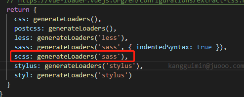
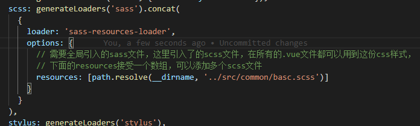

# juooo-web
# iview
> A Vue.js project

## Build Setup

For a detailed explanation on how things work, check out the [guide](http://vuejs-templates.github.io/webpack/) and [docs for vue-loader](http://vuejs.github.io/vue-loader).

#### 用法
1. 使用scss
```
    cnpm run  sass-loader -D
    cnpm run  node-sass -D
```
2. 如果需要全局引入.scss文件的配置
```
    第一步：cnpm run  sass-resources-loader -D
    第二步：在项目里找到build/utils文件 如下:
```

```
    第三步：修改为
```

3. 适配问题
```
   # cnpm run lib-flexible -S 
    // 在main.js中引入`import 'lib-flexible'`
    
   # cnpm install postcss-pxtorem -D 
    // 将px 转换 rem 
    // 配置见 **.postcssrc.js**
```
3. vant 用法
 ```
  # cnpm i vant -s 
  
  # cnpm i babel-plugin-import -D 
  // 安装 babel-plugin-import 插件，babel-plugin-import
  // 是一款 babel 插件，它会在编译过程中将 import
  // 的写法自动转换为按需引入的方式
    
  // 在.babelrc文件中配置plugins（插件）
  `"plugins": [
    "transform-vue-jsx", 
    "transform-runtime",
    ["import", { "libraryName": "vant", "style": true }]
  ],`
  
  // vant 用的rem 比例（37.5）与本项目比例（75）不同
  // 在.postcssrc.js中修改配置即可（见该文件）
 ```
