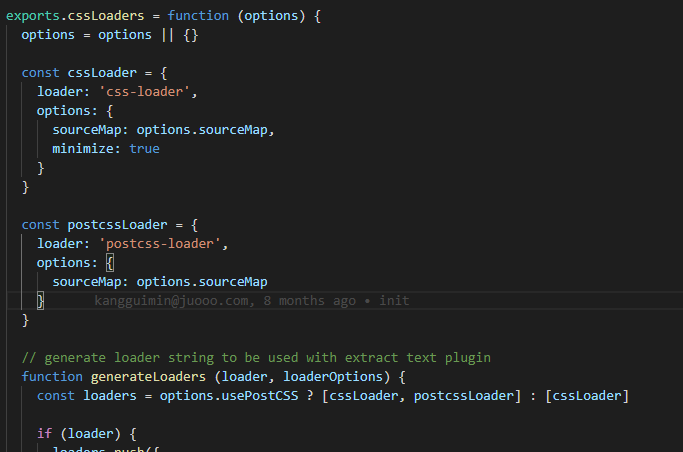
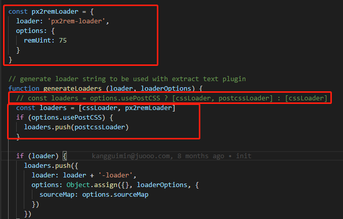

# juooo-web
# iview
> A Vue.js project

## Build Setup

``` bash
# install dependencies
npm install

# serve with hot reload at localhost:8080
npm run dev

# build for production with minification
npm run build

# build for production and view the bundle analyzer report
npm run build --report

# run unit tests
npm run unit

# run e2e tests
npm run e2e

# run all tests
npm test
```

For a detailed explanation on how things work, check out the [guide](http://vuejs-templates.github.io/webpack/) and [docs for vue-loader](http://vuejs.github.io/vue-loader).

#### 用法
1. 使用scss
```
    cnpm run  sass-loader -D
    cnpm run  node-sass -D
```
2. 如果需要全局引入.scss文件
```
    第一步：cnpm run  sass-resources-loader -D
    第二步：在项目里找到build/utils文件 如下:
    
    第三步：修改为
    
```
3. 适配问题
```
   1. cnpm run lib-flexible -S 
   引入 lib-flexible
   在main.js中引入`import 'lib-flexible'`
   2. cnpm install px2rem-loader -D (自动将css中的px转换成rem)
   打开build/utils.js文件，找到exports.cssLoaders方法，在里面添加如下代码
   
   const px2remLoader = {
    loader: 'px2rem-loader',
    options: {
      remUint: 75
    }
  }
  修改generateLoaders方法中的loaders
  
  // 注释掉这一行
    // const loaders = options.usePostCSS ? [cssLoader, postcssLoader] : [cssLoader]
    // 修改为
    const loaders = [cssLoader, px2remLoader]

    if (options.usePostCSS) {
    loaders.push(postcssLoader)
    }
    注： 如果在.vue文件style中的某一行代码不希望被转成rem，只要在后面写上注释 /* no*/就可以了
```
